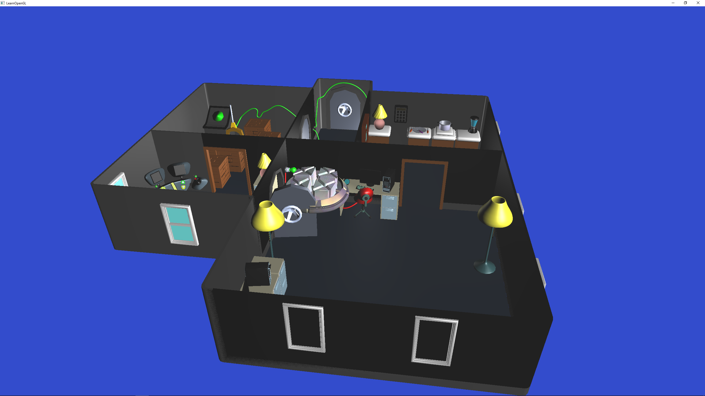

# OpenGLRenderer
A custom OpenGL Renderer written in C++ using Visual Studio 2019 while I go through chapters of [LearnOpengl.com](https://learnopengl.com) and learn C++.

An example render with a model I created in blender:

## Features
* Obj loading with Assimp
* Texture loading with stb_image
* Blinn-phong lighting with texturing
## Dependencies

* [GLFW](https://www.glfw.org)
* [glad](https://glad.dav1d.de)
* [stb_image](https://github.com/nothings/stb)
* [glm](https://github.com/g-truc/glm)
* [assimp](https://github.com/assimp/assimp)